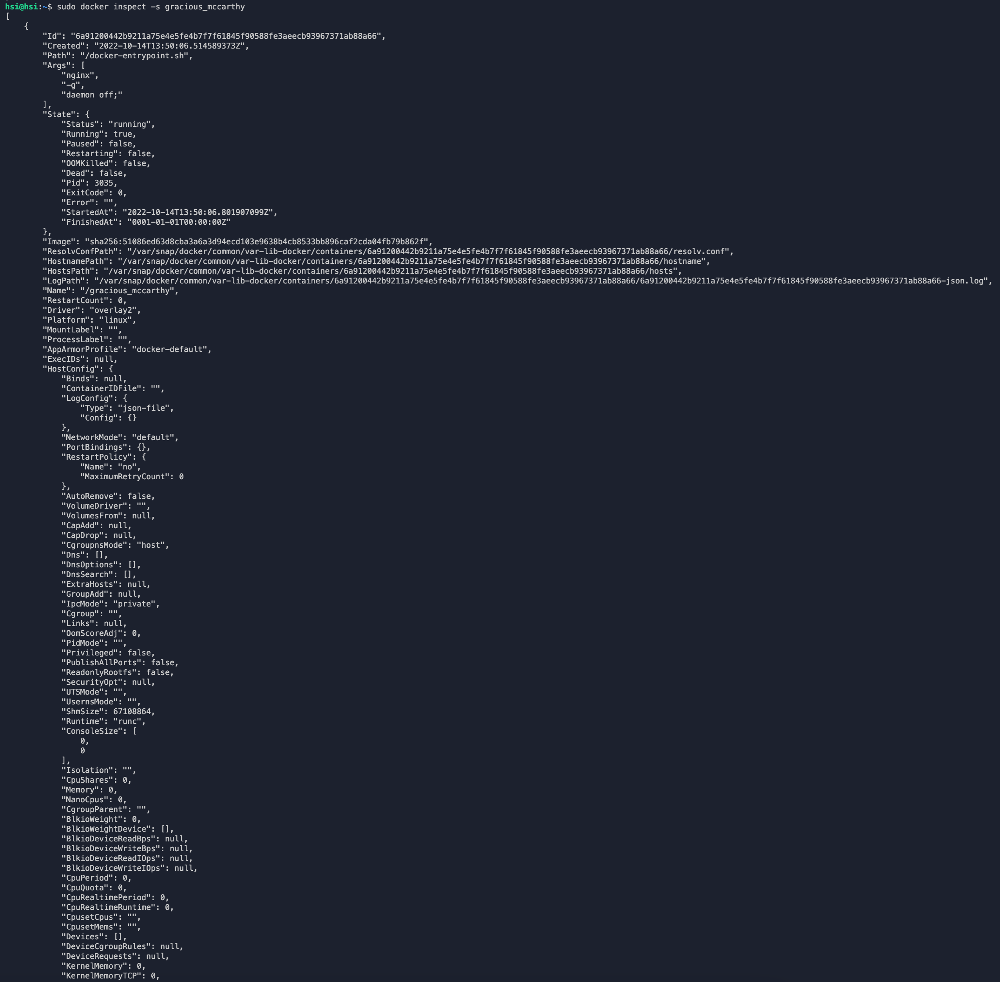

# Simple Docker

## Part 1. Готовый докер

##### Взяла официальный докер образ с **nginx** и выкачала его при помощи `docker pull`
##### Проверила наличие докер образа через `docker images`
##### Запустила докер образ через `docker run -d [image_id|repository]`
##### Проверила, что образ запустился через `docker ps`
 *comands* 

##### Посмотрела информацию о контейнере через `docker inspect [container_id|container_name]`
 *docker inspect* 

##### По выводу команды определила и поместила в отчёт размер контейнера, список замапленных портов и ip контейнера

##### Остановила докер образ через `docker stop [container_id|container_name]`
 *docker stop* 

##### Проверила, что образ остановился через `docker ps`
 *docker ps* 

##### Запустила докер с замапленными портами 80 и 443 на локальную машину через команду *run*
##### Проверила, что в браузере по адресу *localhost:80* доступна стартовая страница **nginx**
 *docker run -p 80:80 -p 443:443 -d nginx* 

##### Перезапустила докер контейнер через `docker restart [container_id|container_name]` и проверила любым способом, что контейнер запустился
 *docker restart* 

## Part 2. Операции с контейнером

##### Прочитала конфигурационный файл *nginx.conf* внутри докер образа через команду *exec*
 *docker exec* 

##### Создала на локальной машине файл *nginx.conf*
 *nginx.conf* 

##### Настроила в нем по пути */status* отдачу страницы статуса сервера **nginx**
 */status* 

##### Скопировала созданный файл *nginx.conf* внутрь докер образа через команду `docker cp` и перезапустила **nginx** внутри докер образа через команду *exec*
 *docker cp && reload* 

##### Проверила, что по адресу *localhost:80/status* отдается страничка со статусом сервера **nginx**
 *localhost:8080/status* 

##### Экспортировала контейнер в файл *container.tar* через команду *export*, остановила контейнер и удалила образ через `docker rmi [image_id|repository]`, не удаляя перед этим контейнеры
 *docker rmi* 
 *docker rmi* 

##### Удалила остановленный контейнер
##### Импортировала контейнер обратно через команду *import*, запустила импортированный контейнер
 *docker system prune -a* 
 *docker* 

##### Проверила, что по адресу *localhost:80/status* отдается страничка со статусом сервера **nginx**
 *localhost:80/status* 
 *localhost:80/status* 